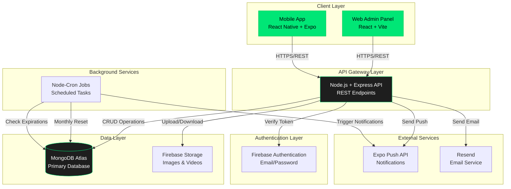
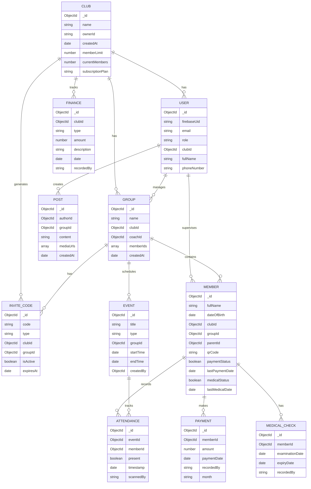
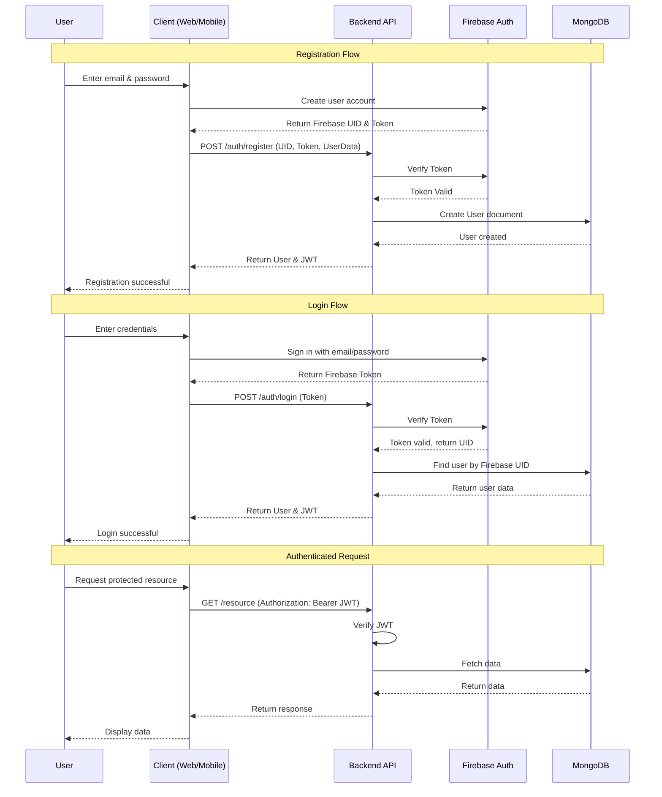
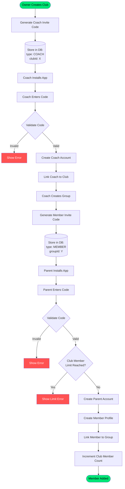
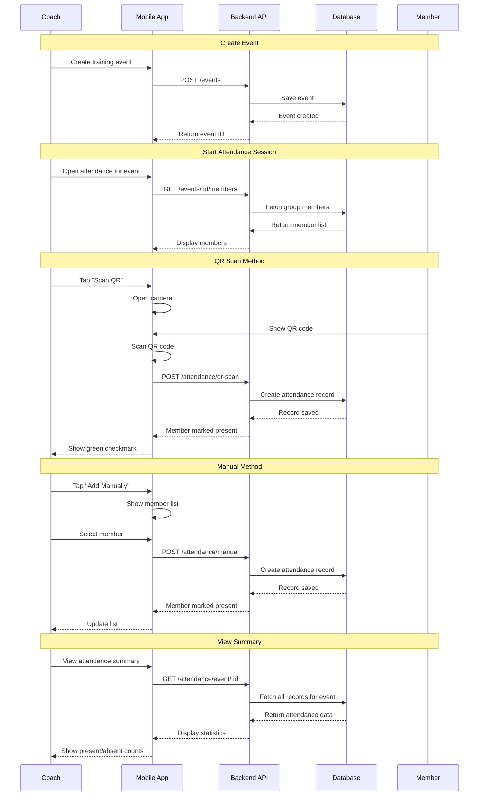
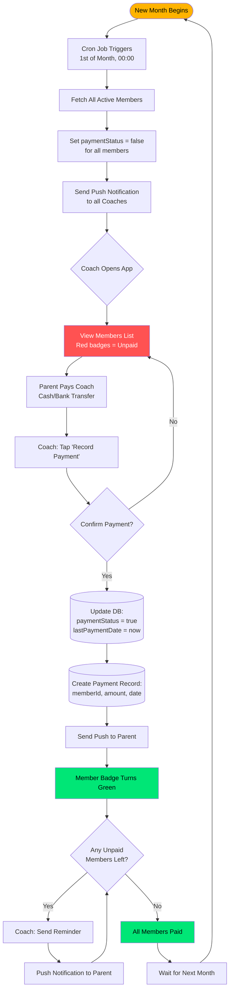
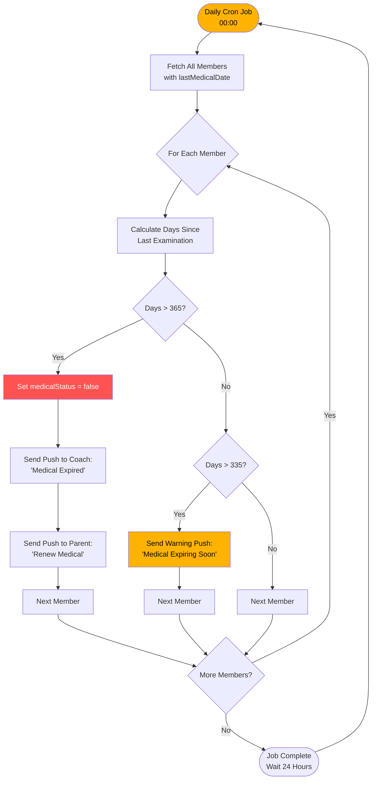
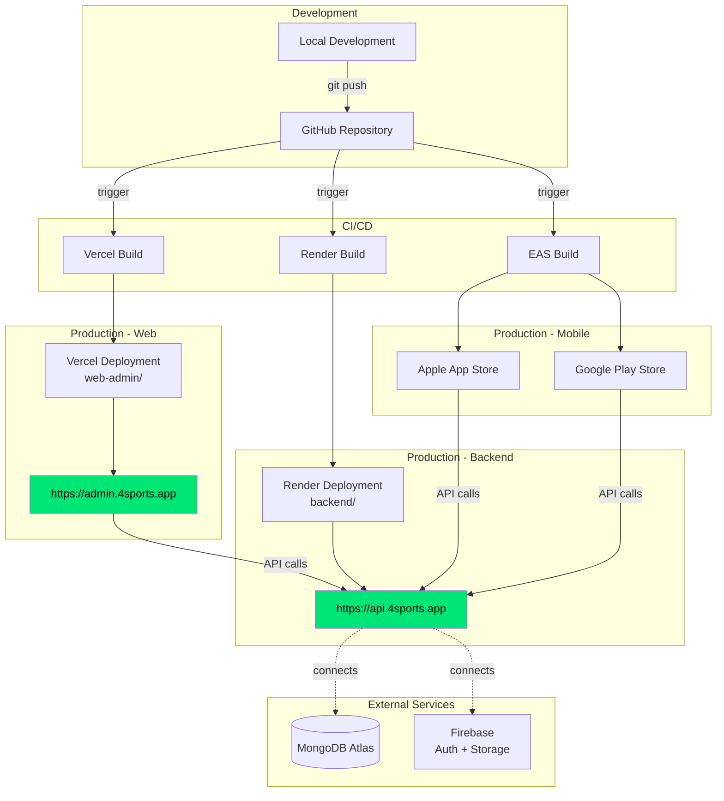
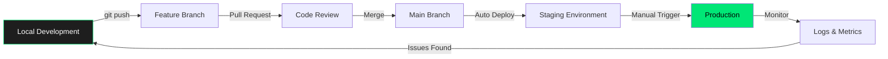

# 4SPORTS — SYSTEM ARCHITECTURE

**Verzija:** 1.0
**Status:** Ready for Development
**Type:** Monorepo Architecture

---

## 1. High-Level Architecture Overview



---

## 2. Monorepo Structure

```
4sports-monorepo/
├── backend/                    # Node.js API Server
├── web-admin/                  # React Web Dashboard
├── mobile-app/                 # React Native App
├── shared/                     # Shared types & utilities (Future)
├── docs/                       # Documentation
│   ├── PRD.md
│   ├── ARCHITECTURE.md
│   ├── API_SPEC.md
│   ├── DESIGN_GUIDELINES.md
│   └── IMPLEMENTATION_PLAN.md
└── README.md
```

---

## 3. Backend Architecture

### 3.1 Folder Structure

```
backend/
├── src/
│   ├── config/
│   │   ├── db.ts              # MongoDB connection
│   │   ├── firebase.ts        # Firebase Admin SDK
│   │   └── env.ts             # Environment variables
│   ├── models/
│   │   ├── Club.ts            # Club schema
│   │   ├── User.ts            # Users (Owner, Coach, Parent)
│   │   ├── Member.ts          # Members (Athletes)
│   │   ├── Group.ts           # Training groups
│   │   ├── Event.ts           # Trainings & Competitions
│   │   ├── Attendance.ts      # Attendance records
│   │   ├── Payment.ts         # Payment records
│   │   ├── MedicalCheck.ts    # Medical examination records
│   │   ├── InviteCode.ts      # Invite codes
│   │   ├── Finance.ts         # Manual finance entries
│   │   └── Post.ts            # News feed posts
│   ├── controllers/
│   │   ├── authController.ts
│   │   ├── clubController.ts
│   │   ├── userController.ts
│   │   ├── memberController.ts
│   │   ├── groupController.ts
│   │   ├── eventController.ts
│   │   ├── attendanceController.ts
│   │   ├── paymentController.ts
│   │   ├── medicalController.ts
│   │   ├── inviteController.ts
│   │   ├── financeController.ts
│   │   └── postController.ts
│   ├── routes/
│   │   ├── index.ts           # Main router
│   │   ├── authRoutes.ts
│   │   ├── clubRoutes.ts
│   │   ├── userRoutes.ts
│   │   ├── memberRoutes.ts
│   │   ├── groupRoutes.ts
│   │   ├── eventRoutes.ts
│   │   ├── attendanceRoutes.ts
│   │   ├── paymentRoutes.ts
│   │   ├── medicalRoutes.ts
│   │   ├── inviteRoutes.ts
│   │   ├── financeRoutes.ts
│   │   └── postRoutes.ts
│   ├── middleware/
│   │   ├── authMiddleware.ts  # JWT verification
│   │   ├── roleMiddleware.ts  # Role-based access
│   │   ├── uploadMiddleware.ts # File upload handling
│   │   ├── validationMiddleware.ts # Request validation
│   │   └── errorMiddleware.ts # Error handling
│   ├── services/
│   │   ├── authService.ts
│   │   ├── emailService.ts    # Resend integration
│   │   ├── pushService.ts     # Expo Push API
│   │   ├── storageService.ts  # Firebase Storage
│   │   └── qrService.ts       # QR code generation
│   ├── utils/
│   │   ├── cronJobs.ts        # Scheduled tasks
│   │   ├── helpers.ts         # Utility functions
│   │   └── constants.ts       # App constants
│   ├── types/
│   │   └── index.ts           # TypeScript types
│   └── index.ts               # Entry point
├── tests/                     # Test files
├── .env.example
├── package.json
├── tsconfig.json
└── README.md
```

### 3.2 Database Schema Architecture



---

## 4. Frontend Architecture

### 4.1 Web Admin Panel Structure

```
web-admin/
├── public/
├── src/
│   ├── assets/
│   │   ├── images/
│   │   └── icons/
│   ├── components/
│   │   ├── ui/                # shadcn/ui components
│   │   │   ├── button.tsx
│   │   │   ├── card.tsx
│   │   │   ├── input.tsx
│   │   │   ├── modal.tsx
│   │   │   ├── table.tsx
│   │   │   └── ...
│   │   ├── charts/
│   │   │   ├── LineChart.tsx
│   │   │   ├── DonutChart.tsx
│   │   │   ├── PieChart.tsx
│   │   │   └── BarChart.tsx
│   │   ├── layout/
│   │   │   ├── Sidebar.tsx
│   │   │   ├── Header.tsx
│   │   │   └── Layout.tsx
│   │   └── shared/
│   │       ├── DataTable.tsx
│   │       ├── StatusBadge.tsx
│   │       └── LoadingSpinner.tsx
│   ├── features/
│   │   ├── auth/
│   │   │   ├── Login.tsx
│   │   │   └── useAuth.ts
│   │   ├── dashboard/
│   │   │   ├── Dashboard.tsx
│   │   │   ├── KPICard.tsx
│   │   │   └── useDashboard.ts
│   │   ├── members/
│   │   │   ├── MemberList.tsx
│   │   │   ├── MemberForm.tsx
│   │   │   └── useMembers.ts
│   │   ├── finances/
│   │   │   ├── FinanceOverview.tsx
│   │   │   ├── TransactionList.tsx
│   │   │   └── useFinances.ts
│   │   ├── coaches/
│   │   │   ├── CoachList.tsx
│   │   │   └── ContractManagement.tsx
│   │   └── settings/
│   │       ├── ClubSettings.tsx
│   │       └── SubscriptionManagement.tsx
│   ├── hooks/
│   │   ├── useAuth.ts
│   │   ├── useApi.ts
│   │   └── useToast.ts
│   ├── lib/
│   │   ├── axios.ts           # API client
│   │   ├── utils.ts
│   │   └── constants.ts
│   ├── services/
│   │   └── api.ts             # API functions
│   ├── types/
│   │   └── index.ts
│   ├── App.tsx
│   └── main.tsx
├── index.html
├── tailwind.config.js
├── vite.config.ts
└── package.json
```

### 4.2 Mobile App Structure

```
mobile-app/
├── app/                       # Expo Router
│   ├── (auth)/
│   │   ├── login.tsx
│   │   ├── register.tsx
│   │   └── invite-code.tsx
│   ├── (coach)/               # Coach role screens
│   │   ├── (tabs)/
│   │   │   ├── _layout.tsx
│   │   │   ├── index.tsx      # Dashboard
│   │   │   ├── calendar.tsx
│   │   │   ├── members.tsx
│   │   │   └── profile.tsx
│   │   ├── attendance/
│   │   │   ├── scan-qr.tsx
│   │   │   ├── manual-add.tsx
│   │   │   └── session-[id].tsx
│   │   ├── payment/
│   │   │   ├── record-payment.tsx
│   │   │   └── send-reminder.tsx
│   │   ├── medical/
│   │   │   └── record-exam.tsx
│   │   └── news/
│   │       └── create-post.tsx
│   ├── (parent)/              # Parent role screens
│   │   ├── (tabs)/
│   │   │   ├── _layout.tsx
│   │   │   ├── index.tsx      # Home
│   │   │   ├── calendar.tsx
│   │   │   └── profile.tsx
│   │   └── member/
│   │       └── [id].tsx       # Member details
│   ├── _layout.tsx            # Root layout
│   └── index.tsx              # Entry point
├── assets/
│   ├── images/
│   └── fonts/
├── components/
│   ├── ui/
│   │   ├── Button.tsx
│   │   ├── Card.tsx
│   │   ├── Input.tsx
│   │   └── Badge.tsx
│   ├── MemberCard.tsx
│   ├── EventCard.tsx
│   ├── QRCodeDisplay.tsx
│   ├── QRScanner.tsx
│   └── Calendar.tsx
├── constants/
│   ├── Colors.ts
│   └── Layout.ts
├── hooks/
│   ├── useAuth.ts
│   ├── useApi.ts
│   └── usePushNotifications.ts
├── services/
│   ├── api.ts
│   ├── auth.ts
│   ├── storage.ts
│   └── notifications.ts
├── types/
│   └── index.ts
├── utils/
│   └── helpers.ts
├── app.json
└── package.json
```

---

## 5. Authentication Flow



---

## 6. Invite Code System Flow



---

## 7. Attendance Tracking Flow



---

## 8. Payment & Membership Logic Flow



---

## 9. Medical Check Expiration Flow



---

## 10. Data Synchronization Strategy

### 10.1 Real-time Updates (Future Enhancement)
Currently using REST API with polling. Future implementation could use:
- **WebSockets** for real-time attendance updates
- **Firebase Realtime Database** for live event changes
- **React Query** with auto-refresh for dashboard KPIs

### 10.2 Caching Strategy

**Web Admin:**
```typescript
// React Query configuration
const queryClient = new QueryClient({
  defaultOptions: {
    queries: {
      staleTime: 5 * 60 * 1000, // 5 minutes
      cacheTime: 10 * 60 * 1000, // 10 minutes
      refetchOnWindowFocus: true,
    },
  },
});
```

**Mobile App:**
```typescript
// Cache attendance records locally
import AsyncStorage from '@react-native-async-storage/async-storage';

// Sync when online
const syncAttendance = async () => {
  const cached = await AsyncStorage.getItem('pending_attendance');
  if (cached && isOnline) {
    await api.post('/attendance/bulk', JSON.parse(cached));
    await AsyncStorage.removeItem('pending_attendance');
  }
};
```

---

## 11. Security Architecture

### 11.1 Authentication Layers

```
1. Firebase Authentication (User Identity)
   ↓
2. Custom JWT Token (API Access)
   ↓
3. Role-Based Middleware (Permission Check)
   ↓
4. Resource Ownership Validation (Data Access)
```

### 11.2 API Security Measures

```typescript
// Rate Limiting
import rateLimit from 'express-rate-limit';

const limiter = rateLimit({
  windowMs: 15 * 60 * 1000, // 15 minutes
  max: 100, // limit each IP to 100 requests per windowMs
});

// Helmet.js for security headers
import helmet from 'helmet';
app.use(helmet());

// CORS configuration
const corsOptions = {
  origin: [
    'https://yourdomain.com',
    'exp://localhost:19000', // Expo dev
  ],
  credentials: true,
};
```

### 11.3 Data Validation

```typescript
// Zod schemas for request validation
import { z } from 'zod';

const createMemberSchema = z.object({
  fullName: z.string().min(2).max(100),
  dateOfBirth: z.string().datetime(),
  groupId: z.string().regex(/^[0-9a-fA-F]{24}$/),
  parentId: z.string().regex(/^[0-9a-fA-F]{24}$/),
});
```

---

## 12. Performance Optimization

### 12.1 Backend Optimizations

```typescript
// Database indexing
memberSchema.index({ clubId: 1, groupId: 1 });
memberSchema.index({ qrCode: 1 }, { unique: true });
attendanceSchema.index({ eventId: 1, memberId: 1 });
paymentSchema.index({ memberId: 1, paymentDate: -1 });

// Query optimization
const members = await Member.find({ clubId })
  .select('fullName paymentStatus medicalStatus')
  .lean(); // Returns plain JS objects, faster

// Aggregation pipelines for dashboard
const stats = await Payment.aggregate([
  { $match: { clubId: new ObjectId(clubId) } },
  { $group: {
      _id: { $month: '$paymentDate' },
      total: { $sum: '$amount' },
      count: { $sum: 1 }
    }
  },
]);
```

### 12.2 Frontend Optimizations

```typescript
// Code splitting
const Dashboard = lazy(() => import('./features/dashboard/Dashboard'));
const MemberList = lazy(() => import('./features/members/MemberList'));

// Virtualized lists for large datasets
import { VirtualizedList } from '@tanstack/react-virtual';

// Image optimization
<Image
  source={{ uri: imageUrl }}
  resizeMode="cover"
  defaultSource={require('./placeholder.png')}
/>
```

---

## 13. Deployment Architecture



### Deployment Configuration

**Vercel (Web Admin):**
```json
{
  "buildCommand": "cd web-admin && npm run build",
  "outputDirectory": "web-admin/dist",
  "installCommand": "cd web-admin && npm install"
}
```

**Render (Backend):**
```yaml
services:
  - type: web
    name: 4sports-api
    env: node
    buildCommand: cd backend && npm install && npm run build
    startCommand: cd backend && npm start
    envVars:
      - key: NODE_ENV
        value: production
      - key: MONGODB_URI
        sync: false
      - key: FIREBASE_PROJECT_ID
        sync: false
```

**EAS (Mobile):**
```json
{
  "build": {
    "production": {
      "node": "18.x.x",
      "channel": "production",
      "env": {
        "API_URL": "https://api.4sports.app"
      }
    }
  }
}
```

---

## 14. Monitoring & Logging

### 14.1 Backend Logging

```typescript
import winston from 'winston';

const logger = winston.createLogger({
  level: 'info',
  format: winston.format.json(),
  transports: [
    new winston.transports.File({ filename: 'error.log', level: 'error' }),
    new winston.transports.File({ filename: 'combined.log' }),
  ],
});

// Log critical events
logger.info('Member payment recorded', { memberId, amount });
logger.error('Payment failed', { error: e.message, memberId });
```

### 14.2 Error Tracking

```typescript
// Sentry integration (optional, paid service)
import * as Sentry from '@sentry/node';

Sentry.init({ dsn: process.env.SENTRY_DSN });

app.use(Sentry.Handlers.errorHandler());
```

### 14.3 Uptime Monitoring

**UptimeRobot** (Free):
- Monitor API endpoint: `https://api.4sports.app/health`
- Check every 5 minutes
- Ping to keep Render free tier awake

---

## 15. Scalability Considerations

### Current MVP Architecture (Free Tier)
- **MongoDB Atlas M0**: 512 MB storage, ~100 members per club
- **Render Free**: Sleeps after inactivity, 750 hours/month
- **Vercel Hobby**: 100 GB bandwidth/month
- **Firebase Spark**: 1 GB storage, 50K reads/day

### Future Scaling Path
1. **Phase 1** (10-50 clubs):
   - Upgrade MongoDB to M2 ($9/month)
   - Render Starter ($7/month) - No sleep

2. **Phase 2** (50-200 clubs):
   - MongoDB M5 ($25/month)
   - Render Standard ($25/month)
   - Firebase Blaze (Pay as you go)
   - Implement Redis for caching

3. **Phase 3** (200+ clubs):
   - Microservices architecture
   - Load balancers
   - CDN for media files
   - Dedicated database cluster

---

## 16. Backup & Disaster Recovery

### Automated Backups

```typescript
// MongoDB Atlas: Daily automatic backups (included in free tier)
// Retention: 2 days on M0, configure longer on paid tiers

// Manual backup script
import { execSync } from 'child_process';

const backupDatabase = () => {
  const timestamp = new Date().toISOString();
  const command = `mongodump --uri="${MONGODB_URI}" --out="./backups/${timestamp}"`;
  execSync(command);
};

// Run weekly via cron
```

### Firebase Storage Backup
```typescript
// Download all files to external storage
import admin from 'firebase-admin';

const bucket = admin.storage().bucket();
const [files] = await bucket.getFiles();

for (const file of files) {
  await file.download({ destination: `./backup/${file.name}` });
}
```

---

## 17. Development Workflow



---

## 18. Testing Strategy

### Backend Testing
```typescript
// Unit tests with Jest
import { createMember } from '../controllers/memberController';

describe('Member Controller', () => {
  test('should create member when limit not reached', async () => {
    const result = await createMember(mockReq, mockRes);
    expect(result.status).toBe(201);
  });

  test('should reject member when limit reached', async () => {
    // Mock club with current_members >= limit
    const result = await createMember(mockReq, mockRes);
    expect(result.status).toBe(403);
  });
});
```

### Frontend Testing
```typescript
// Component tests with React Testing Library
import { render, screen } from '@testing-library/react';
import MemberCard from './MemberCard';

test('renders member name and status', () => {
  render(<MemberCard member={mockMember} />);
  expect(screen.getByText('John Doe')).toBeInTheDocument();
  expect(screen.getByText('PAID')).toBeInTheDocument();
});
```

### E2E Testing (Future)
```typescript
// Playwright for critical user flows
import { test, expect } from '@playwright/test';

test('coach can mark attendance', async ({ page }) => {
  await page.goto('/attendance/scan');
  await page.click('button:has-text("Scan QR")');
  // ... simulate QR scan
  await expect(page.locator('.member-status')).toHaveClass('present');
});
```

---

## 19. API Versioning Strategy

```typescript
// Current: /api/v1/...
// Future: /api/v2/... (when breaking changes needed)

app.use('/api/v1', routerV1);
app.use('/api/v2', routerV2); // Future

// Client specifies version in header (alternative)
const version = req.headers['api-version'] || 'v1';
```

---

## 20. Next Steps

1. **Initialize monorepo structure**
2. **Set up backend with Express + MongoDB**
3. **Configure Firebase Authentication**
4. **Create core API endpoints**
5. **Build web admin dashboard**
6. **Develop mobile app with Expo**
7. **Implement cron jobs for automation**
8. **Deploy to staging environments**
9. **Conduct testing**
10. **Launch MVP**

---

**This architecture is designed to be:**
- ✅ Cost-effective (entirely on free tiers for MVP)
- ✅ Scalable (clear path to paid tiers as you grow)
- ✅ Maintainable (single developer can manage entire stack)
- ✅ Modern (uses latest best practices and tools)
